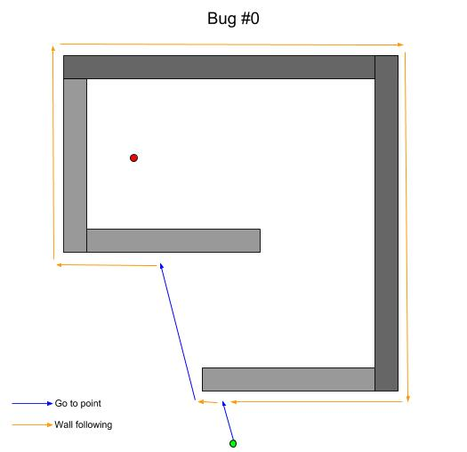
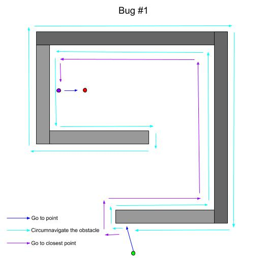

## ROS Differential-drive Robot in Gazebo and Rviz

### ROS version: Kinetic (Ubuntu 16.04)

#### Navigation using Keyboard

$ export world=world_01  
$ roslaunch m2wr_description spawn.launch  
$ rosrun teleop_twist_keyboard teleop_twist_keyboard.py  

  

#### Obstacle Avoidance

$ export world=world_02  
$ roslaunch m2wr_description spawn.launch y:=2  
$ rosrun m2wr_motion_plan obstacle_avoidance.py  

  

#### Go to Goal

$ export world=world_02  
$ roslaunch m2wr_description spawn.launch world:= world_02 x:=-7 y:=3  
$ rosparam set /goal_x 5  
$ rosparam set /goal_y 1  
$ rosrun m2wr_motion_plan go_to_goal.py  
$ rosservice call /go_to_goal_switch "data: true"  
$ rosservice call /go_to_goal_switch "data: false"  

  

#### Right Wall Following

$ export world=world_02  
$ roslaunch m2wr_description spawn.launch y:=2  
$ rosrun m2wr_motion_plan right_wall_following.py  
$ rosservice call /right_wall_following_switch "data: true"  

  

#### Bug 0 Algorithm

Initial: [0, 8]  
Goal: [0, -6]  
  
$ export world=world_02  
$ roslaunch m2wr_description spawn.launch x:=0 y:=8  
$ roslaunch m2wr_motion_plan bug0_algorithm.launch  

  

#### Bug 0 Algorithm Failure Case

Initial: [0, 8]  
Goal: [2, -3]  
  
$ export world=world_03  
$ roslaunch m2wr_description spawn.launch x:=0 y:=8  
$ roslaunch m2wr_motion_plan bug0_algorithm.launch goal_x:=2 goal_y:=-3  

  

#### Bug 1 Algorithm

Initial: [0, 8]  
Goal: [2, -3]  
  
$ export world=world_03  
$ roslaunch m2wr_description spawn.launch x:=0 y:=8  
$ roslaunch m2wr_motion_plan bug1_algorithm.launch goal_x:=0 goal_y:=-3  

  

  

$ rosrun m2wr_motion_plan reading_laserscan.py  
$ roslaunch m2wr_description rviz.launch  
